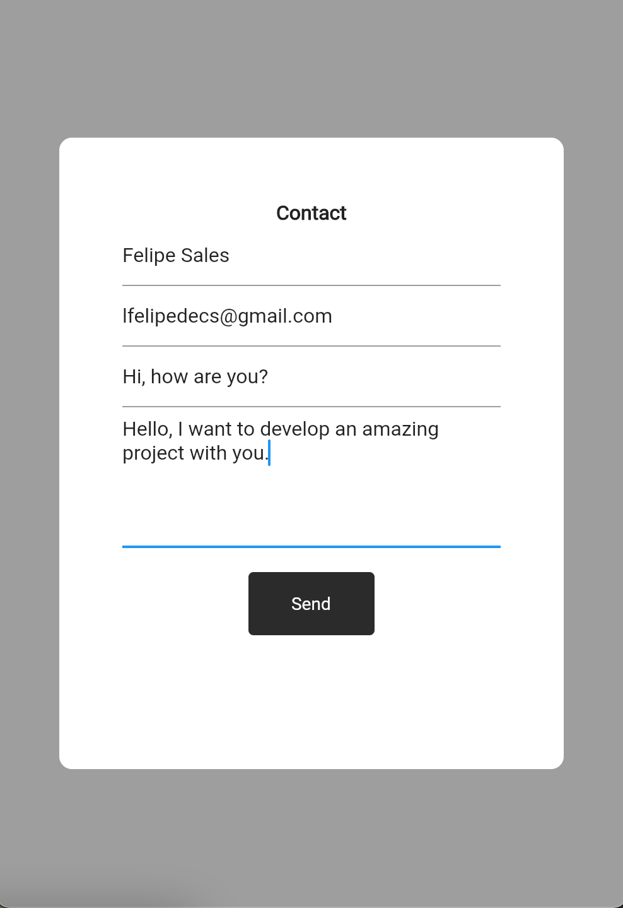
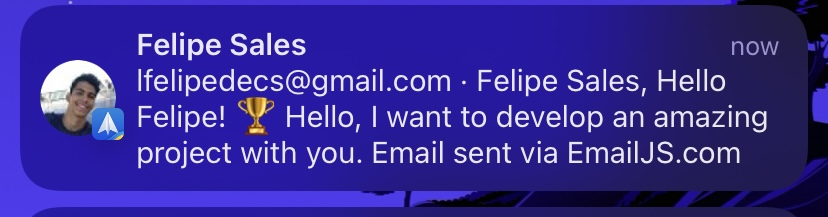

<h1 align="center">Send Mail</h1>

---

<h2>📖 About</h2>

 This was a small test of sending email using the <a href="https://www.emailjs.com/">emailjs platform</a>.

<h2>📱 Preview</h2>

   

      
   

   

      
   

---

<h2 align="center">License 📝</h2>

   This repository is under MIT license. You can see the <a href="https://github.com/felipecastrosales/send-mail/blob/master/LICENSE">LICENSE</a> file for more details. 😉

---

   

   

   

